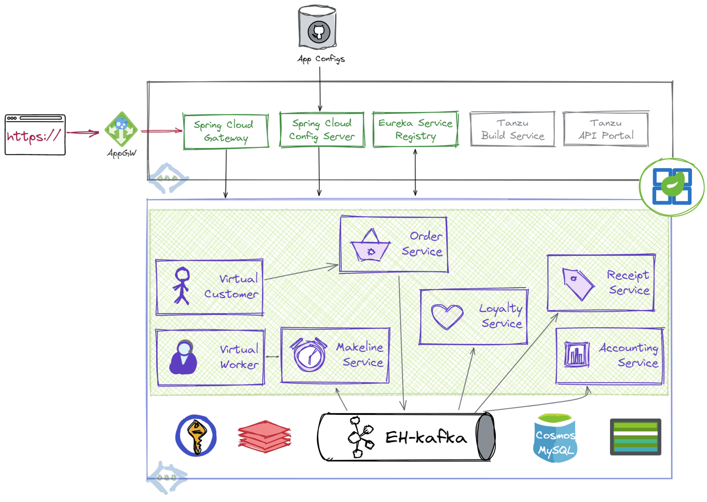

# reddog-asa

## :warning: :construction: Java version of [reddog-code](https://github.com/Azure/reddog-code) for [Azure Spring Apps (ASA)](https://docs.microsoft.com/en-us/azure/spring-apps/) and [App Service](https://docs.microsoft.com/en-us/azure/app-service/) is WIP

### Services and port mappings

| Service             | Description                | Key dependencies                                             | port |
| ------------------- | -------------------------- | ------------------------------------------------------------ | ---- |
| Virtual Customer    | Simulates orders           | [webflux](https://docs.spring.io/spring-framework/docs/current/reference/html/web-reactive.html), [jobrunr](https://github.com/jobrunr/jobrunr#readme), [faker](https://github.com/DiUS/java-faker#readme), | 8081 |
| Order Service       | Place and manage orders    | [flyway](https://github.com/flyway/flyway#readme), eh-[kafka](https://spring.io/projects/spring-kafka), [jpa](https://spring.io/guides/gs/accessing-data-jpa/) | 8082 |
| Loyalty Service     | Manage reward points       | [redis](https://github.com/spring-projects/spring-data-redis/blob/main/src/main/asciidoc/reference/reactive-redis.adoc), eh-[kafka](https://spring.io/projects/spring-kafka), [jpa](https://spring.io/guides/gs/accessing-data-jpa/) | 8083 |
| Makeline Service    | Fulfil order queue         |                                                              | 8084 |
| Receipt generation  | Archive receipts           | blob storage                                                 | 8085 |
| Virtual Worker      | Simulate order completion  |                                                              | 8086 |
| Accounting Service  | Process and transform data | jpa                                                          | 8087 |
| local eureka server | Service discovery          |                                                              | 8761 |

