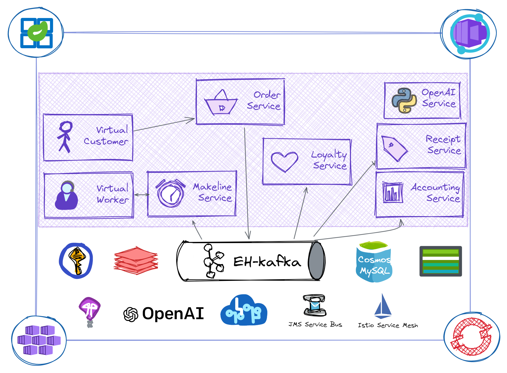

# reddog-asa

### :warning: :construction: Java version of [reddog-code](https://github.com/Azure/reddog-code) for [Azure Spring Apps (ASA)](https://docs.microsoft.com/en-us/azure/spring-apps/) and [App Service](https://docs.microsoft.com/en-us/azure/app-service/) is WIP

### Background

This repo, based on [reddog-code](https://github.com/Azure/reddog-code), is intended for Java/Spring developers to understand Azure hosting options and idiomatic java sdks that integrate with managed backing services. Using a retail scenario that depicts a typical event-driven microservices architecture, this codebase (and associated lab) will ease the migration and modernization of Java workloads on Azure. 




### Pre-reqs:

- [JDK-17](https://learn.microsoft.com/en-us/java/openjdk/overview)
- `JAVA_HOME` set to ^ JDK location
- [Maven](https://maven.apache.org/download.cgi) for building and running the project
- Provision the following services and set their associated entries in `start.sh`
  - Event-Hubs
  - Azure MySQL
  - Azure Redis
  - CosmosDB
  - Storage Account

### Setup:

To run locally, after completing above pre-reqs, install gnu-parallel using `brew install parallel`[^1] , and update the env variables in `start.sh`; then:

```bash
./start.sh
```

#### :construction: Deployment to Azure, via bicep and GH-actions, are WIP

[^1]:[WSL users](https://docs.brew.sh/Homebrew-on-Linux)

### Services and local port mappings

| Service             | Description                | Key dependencies                                             | port |
| ------------------- | -------------------------- | ------------------------------------------------------------ | ---- |
| Virtual Customer    | Simulates orders           | [webflux](https://docs.spring.io/spring-framework/docs/current/reference/html/web-reactive.html), [jobrunr](https://github.com/jobrunr/jobrunr#readme), [faker](https://github.com/DiUS/java-faker#readme), | 8081 |
| Order Service       | Place and manage orders    | [flyway](https://github.com/flyway/flyway#readme), eh-[kafka](https://spring.io/projects/spring-kafka), [jpa](https://spring.io/guides/gs/accessing-data-jpa/) | 8082 |
| Loyalty Service     | Manage reward points       | [redis](https://github.com/spring-projects/spring-data-redis/blob/main/src/main/asciidoc/reference/reactive-redis.adoc), eh-[kafka](https://spring.io/projects/spring-kafka), [jpa](https://spring.io/guides/gs/accessing-data-jpa/) | 8083 |
| Makeline Service    | Fulfil order queue         |                                                              | 8084 |
| Receipt generation  | Archive receipts           | blob storage                                                 | 8085 |
| Virtual Worker      | Simulate order completion  |                                                              | 8086 |
| Accounting Service  | Process and transform data | jpa                                                          | 8087 |
| local eureka server | Service discovery          |                                                              | 8761 |

### Contributing

This project welcomes contributions and suggestions.  Most contributions require you to agree to a
Contributor License Agreement (CLA) declaring that you have the right to, and actually do, grant us
the rights to use your contribution. For details, visit https://cla.opensource.microsoft.com.

When you submit a pull request, a CLA bot will automatically determine whether you need to provide
a CLA and decorate the PR appropriately (e.g., status check, comment). Simply follow the instructions
provided by the bot. You will only need to do this once across all repos using our CLA.

This project has adopted the [Microsoft Open Source Code of Conduct](https://opensource.microsoft.com/codeofconduct/).
For more information see the [Code of Conduct FAQ](https://opensource.microsoft.com/codeofconduct/faq/) or
contact [opencode@microsoft.com](mailto:opencode@microsoft.com) with any additional questions or comments.